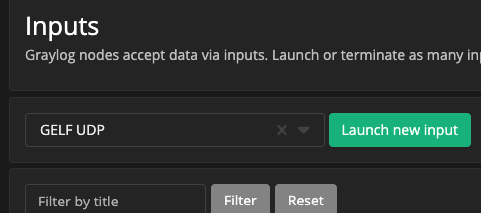
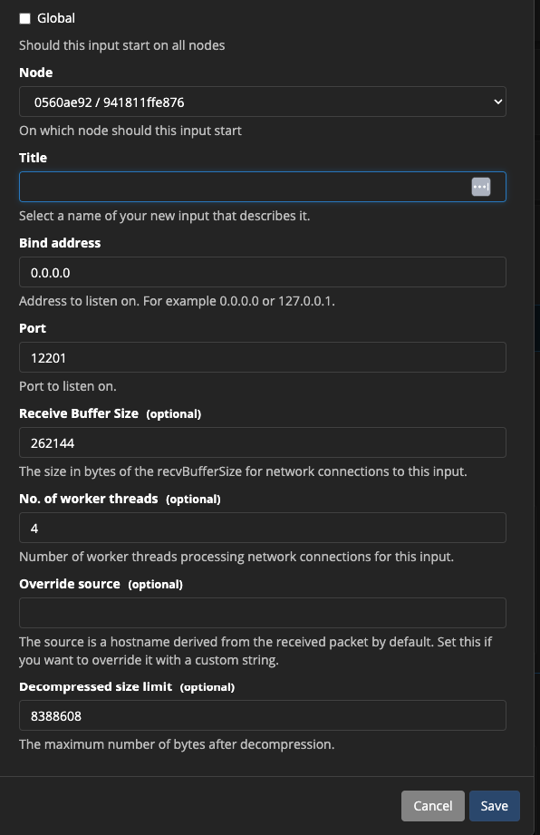
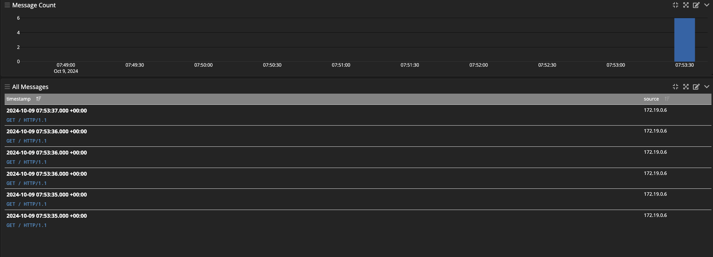

## Graylog for read nginx logs via fluent bit

In this project we will send nginx logs to graylog.

First we will complete the graylog installation and then finish viewing the logs.

The project works on docker.


---

## Setup
Let's create the necessary passwords first.
We will put these passwords in the docker-compose file.


```
# Generate a password secret
#If openssl is not present, you must install it.

GRAYLOG_PASSWORD_SECRET=  # Run the command below to
openssl rand -base64 96


# if you can't use sha you need to install coreutils
# brew install coreutils 
# Generate a hash for the admin password

GRAYLOG_ROOT_PASSWORD_SHA2= # Run the command below to
echo -n yourpassword | sha256sum
```

```
# we can start our services.

docker-compose up -d


http://127.0.0.1:9000/
```

### Graylog Settings
Next we will create an input for graylog.

Let's go to settings/inputs from the menu.





We can create it from port 12201 with default settings. If we choose a different port, we must enter it in the fluent bit conf file.

## Fluent bit

Fluent bit works as a sidecar container in this project.
It reads nginx logs and sends them to the gelf udp channel.
Fluent bit requires two basic files: config file and parser.
There are two files configured for our project in the main directory.

fluent-bit.conf and parsers.conf, these two are configured for nginx.


## example

